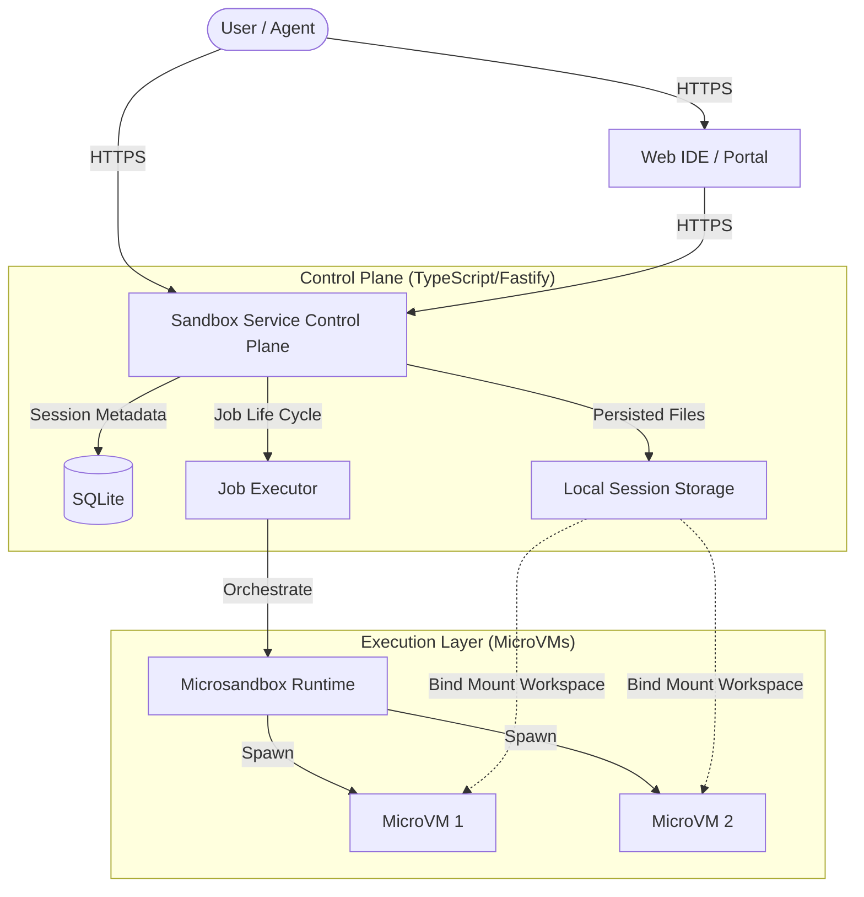
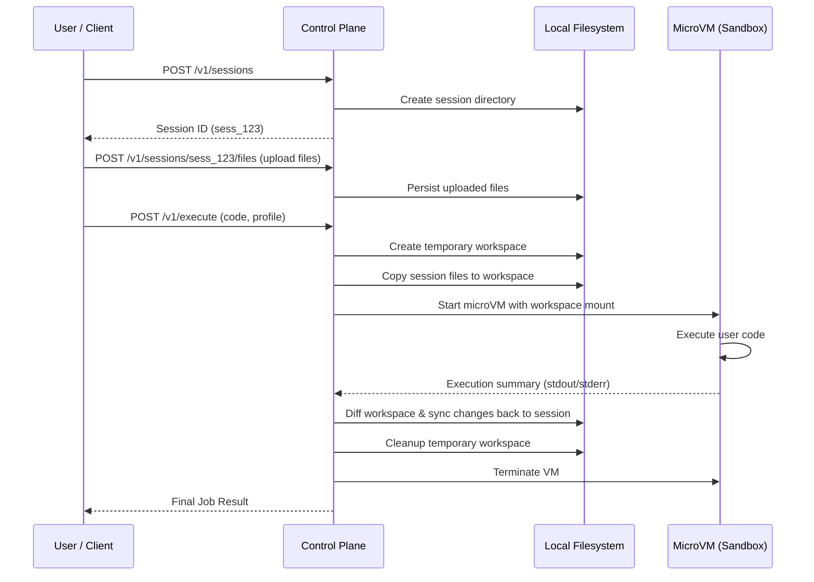

# Sandbox Manager

A self-hosted, high-performance execution service for running moderately risky, agent-generated Python and Bash code in secure, isolated microVMs. It provides a control plane for managing sessions, workspaces, and real-time execution feedback.

## Architecture Overview

The system follows a control-plane/data-plane architecture where a TypeScript service manages the lifecycle of microVMs and persistent file sessions.



## Key Features

- **MicroVM Isolation**: Every job runs in a fresh [Microsandbox](https://github.com/superradcompany/microsandbox) microVM for robust security and performance.
- **Persistent Sessions**: Maintain state across multiple code executions within a single session.
- **Bi-directional Sync**: Automatically stages session files into the sandbox and syncs back any new or modified artifacts after execution.
- **Multi-Runtime Support**: Pre-configured profiles for standard Python and optimized Data Science (NumPy, Pandas, Scikit-learn) environments.
- **Developer Portal**: A premium, IDE-like web interface with a built-in terminal, Monaco Editor, and file explorer.
- **Python Client**: A lightweight client library for programmatic integration with agentic workflows.

## Tech Stack

| Component | Technology |
| :--- | :--- |
| **Backend** | TypeScript, Fastify, Bun, SQLite |
| **Frontend** | React, Vite, Tailwind CSS, Monaco Editor, Shadcn UI |
| **Sandbox** | Microsandbox (MicroVMs), OCI-compliant images |
| **Tooling** | Bun, Just (Task Runner), Docker |

## Project Structure

```text
.
├── service/            # TypeScript control plane (Fastify API)
│   ├── src/            # Core logic (routes, jobs, storage, runtime)
│   └── tests/          # Integration tests for the service
├── web/                # Frontend Developer Portal (React/Vite)
│   ├── src/            # IDE implementation and UI components
│   └── public/         # Static assets
├── python-client/      # Python library for programmatic access
├── images/             # Dockerfiles for sandbox OCI images
├── justfile            # Command orchestration for dev/build/deploy
└── docker-compose.yml  # Infrastructure definitions
```

## Critical Execution Flow

The sequence below illustrates the lifecycle of a single execution job, from session preparation to artifact retrieval.



## Installation & Setup

### Prerequisites

- [Bun](https://bun.sh/) (Runtime & Package Manager)
- [Just](https://github.com/casey/just) (Task runner)
- [Microsandbox](https://github.com/superradcompany/microsandbox) installed on the host
- Docker (for custom runtime images)

### Local Development

1.  **Install dependencies and build the service:**
    ```bash
    just sandbox-build
    ```

2.  **Start the Sandbox Control Plane:**
    ```bash
    just sandbox-up
    ```
    *Logs will be written to `.run/sandbox.log`.*

3.  **Start the Web Portal:**
    ```bash
    just web-up
    ```
    *The IDE will be available at `http://localhost:5173`.*

4.  **Stop everything:**
    ```bash
    just sandbox-down
    just web-down
    ```

## Usage Examples

### Using the Python Client

The Python client provides a type-safe and convenient way to interact with the Sandbox service.

```python
from sandbox_executor_client import SandboxExecutorClient, ExecuteRequest

client = SandboxExecutorClient(base_url="http://localhost:3000")

# 1. Start a persistent session
session = client.create_session()
session_id = session.session_id

# 2. Upload datasets or scripts
client.upload_files(session_id, {
    "input.csv": b"id,val\n1,10\n2,20",
    "analyze.py": b"import pandas as pd; print(pd.read_csv('input.csv').val.sum())"
})

# 3. Execute code in the isolated microVM
result = client.execute(
    ExecuteRequest(
        session_id=session_id,
        code="python analyze.py",
        python_profile="data-science"
    )
)

print(f"Analysis Output: {result.stdout}") # Output: 30

# 4. Download generated artifacts
report_bytes = client.download_file(session_id, "analysis_report.pdf")

# 5. Cleanup
client.delete_session(session_id)
```

### Direct API (Bash)

```bash
# Create a session
SESSION_ID=$(curl -X POST http://localhost:3000/v1/sessions | jq -r .session_id)

# Run a bash script
curl -X POST http://localhost:3000/v1/execute/bash \
  -H "Content-Type: application/json" \
  -d '{
    "session_id": "'$SESSION_ID'",
    "script": "echo \"Hello from session $SESSION_ID\" > hello.txt",
    "entrypoint": "setup.sh"
  }'
```
